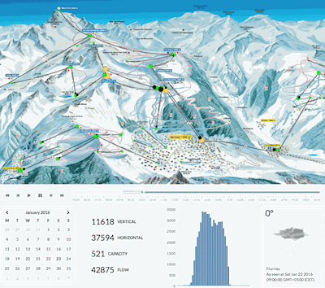
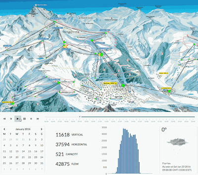

## Ski-pulse

This is our smart-village project for the [Eco-villages Hackathon](http://www.eco-villages.ch/forum/hackathon-2016) 2016 (ranked second on finals).

Using skipass door detecting from 2016 ski season at [Verbier](http://www.verbier.ch) and [Forecast.io](http://forecast.io), we build an interactive data exploration interface to visualize and analyze ski trends. One day skiers flow is shown in this [video example](https://www.youtube.com/watch?v=V1AIZhOLYk8).

Futher developpment could lead to:

- real-time events processing
- skier jam predictions and advise
- better understand infrastructures usage and cost
- improve flow by adjusting time schedule and speed
- optimize snow groomer path
- evaluate skier ecological footprint area-wise
- live slope guide with skiers position

### Getting started

Download the this repository and open `static/index.html` in your preferred browser. You can now explore the whole season using provided tools.

To dig deeper in the data or use the webserver you must be familiar with [Scala](http://www.scala-lang.org) and [sbt](http://www.scala-lang.org).

*Data mining, projections, analyses and visualizing had to be finished in less than 24 hours. Thus strange behaviors may appear, please open an issue in such cases.*

### License

Project is available under [CC-BY-NC-SA 4.0](http://creativecommons.org/licenses/by-nc-sa/4.0/) and data belong their owners under appropriate licensing.
